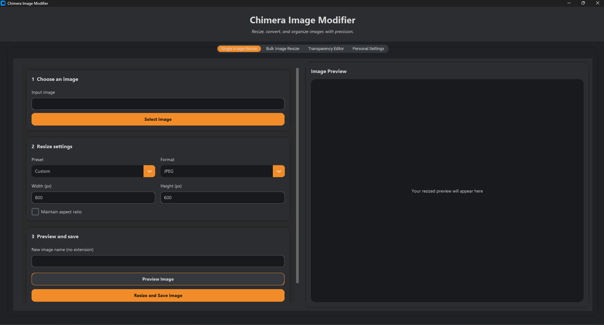
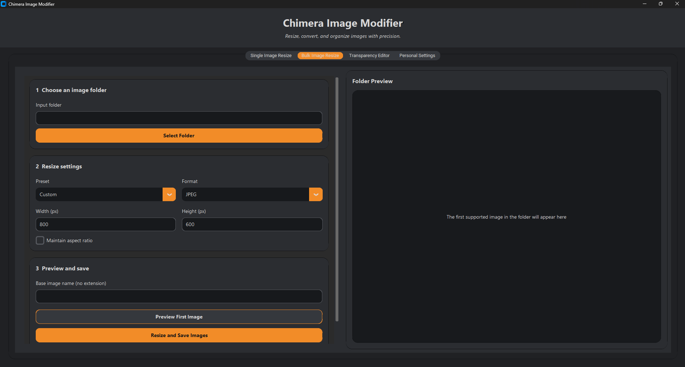
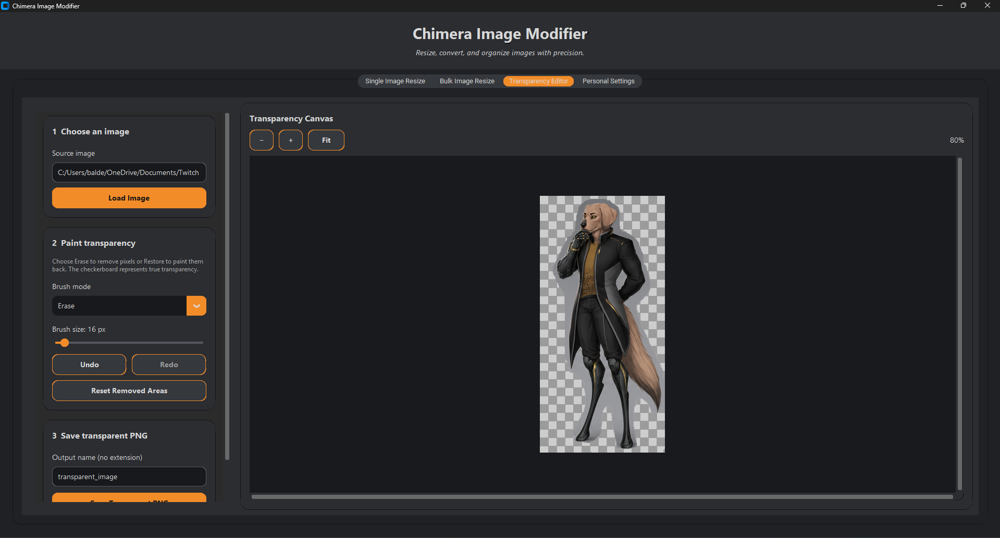
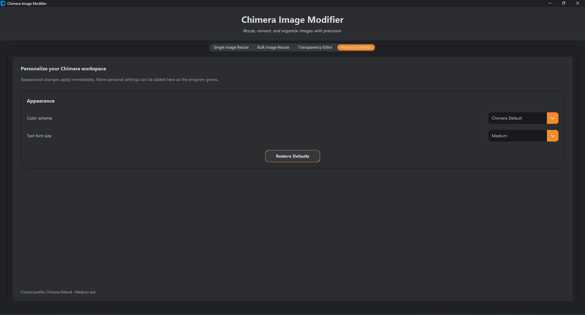

# Chimera Image Modifier

**Chimera Image Modifier** is a desktop image-processing application built with Python, CustomTkinter, and Pillow. It allows users to resize images individually or in bulk, convert between JPG and PNG formats, and manually create transparent PNG files using an interactive editing workspace.

This is the first application in the **Chimera Project Series**, a growing collection of independently developed tools created under a shared visual identity.

---

## Chimera Project Series

The **Chimera Project Series** is a collection of practical applications built to explore software development, user-interface design, and creative problem-solving.

Each project is designed to solve a focused problem while serving as an opportunity to experiment, improve, and build something worth sharing.

**Chimera Image Modifier** is the first project in the series and establishes the visual and structural foundation for future Chimera applications.

---

## Key Features

### Single Image Resizing

* Resize JPG, JPEG, and PNG images.
* Enter custom width and height values.
* Maintain the original aspect ratio.
* Use preset dimensions for Thumbnail, Medium, and HD sizes.
* Preview images before saving.
* Export resized images as JPG or PNG.

### Bulk Image Resizing

* Resize entire folders of supported images.
* Apply shared dimensions, formats, and aspect-ratio settings.
* Preview the first compatible image before processing.
* Automatically number processed filenames.
* Save all completed images to one organized output folder.

### Transparency Editor

* Remove image areas using an adjustable transparency brush.
* Restore previously erased areas.
* Preview transparent regions using a checkerboard background.
* Undo and redo editing actions.
* Zoom in for detailed editing.
* Navigate enlarged images with horizontal and vertical scrolling.
* Save the finished image as a true transparent PNG.

### Personalization

* Choose between Chimera Default, Light, and Dark themes.
* Adjust the application font size.

---

## Application Tabs

The program is organized into four tabs:

1. **Single Image Resize**
2. **Bulk Image Resize**
3. **Transparency Editor**
4. **Personal Settings**

---

## Technologies Used

* Python
* CustomTkinter
* Tkinter
* Pillow
* Git
* GitHub

---

## Installation

### 1. Clone the repository

```bash
git clone https://github.com/JuanBalderas1/automatic-image-resizer.git
```

### 2. Navigate into the project directory

```bash
cd automatic-image-resizer
```

### 3. Install the required dependencies

```bash
python -m pip install -r requirements.txt
```

### 4. Run the application

```bash
python main.py
```

---

## Output

All resized, converted, and transparency-edited images are saved inside:

```text
Modified Images
```

The folder is created automatically when the first image is saved.

---

## Transparency Editor Controls

| Control               | Action              |
| --------------------- | ------------------- |
| `Ctrl + Z`            | Undo                |
| `Ctrl + Y`            | Redo                |
| Mouse wheel           | Scroll vertically   |
| `Shift + Mouse Wheel` | Scroll horizontally |
| `Ctrl + Mouse Wheel`  | Zoom in or out      |

---

## Screenshots

### Single Image Resize



### Bulk Image Resize



### Transparency Editor



### Personal Settings



### Chimera Themes


---

## Planned Improvements

Potential future additions include:

* Drag-and-drop image importing
* Persistent user settings
* Polygon and lasso transparency tools
* Image rotation, flipping, & cropping
* Additional export-quality controls

---

## Project Purpose

This project began as something practical and flexible for my own personal use, but it quickly became something I wanted to be proud to share with anyone interested in creating something for the fun of it.

It serves as a benchmark of my understanding of:

* Desktop application development
* GUI architecture
* Image manipulation
* File and folder processing
* Interactive editing tools
* User-focused feature design

What started as a portfolio project became a passion project fueled by curiosity and pride in developing something practical, flexible, and visually appealing.

---

## Author

Developed by **Juan Balderas**

Part of the **Chimera Project Series**.

---

## License

This project is currently maintained as a personal portfolio and learning project. Licensing information may be added in a future release.
